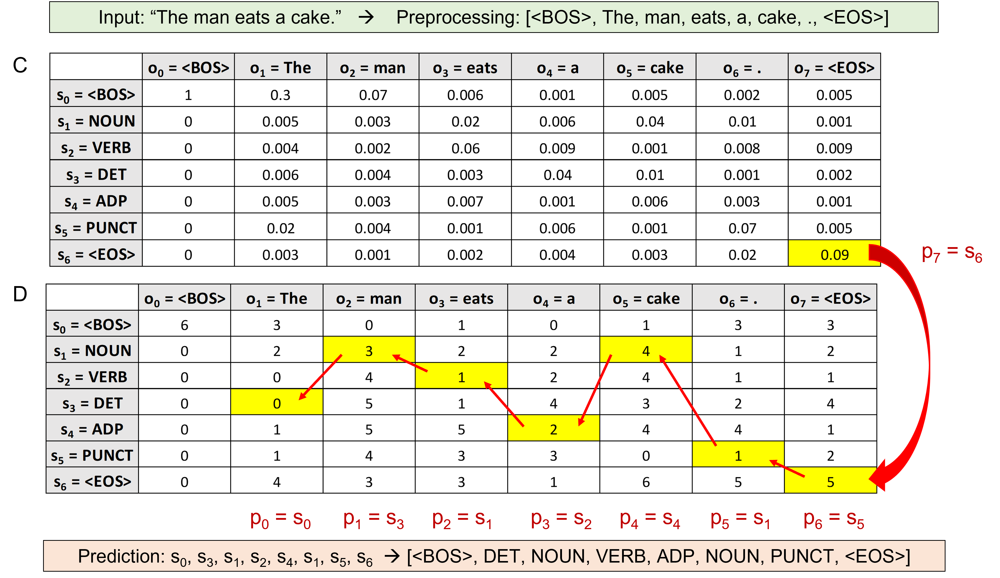

# POS Tagger for Spanish with Hidden Markov Model and Viterbi Optimization

In this project I have implemented a Part-of-Speech Tagger for Spanish. It relies on a Hidden Markov Model optimized at prediction-time with the Viterbi algorithm.

## Models

### Hidden Markov Model (HMM):

HHMs are a probabilistic models that can be used to describe the observable sequential events that depend on internal (hidden) states. The assumption is that each state depends on its first previous one. This does not mean that the rest of previous states have no effect on the current one, but their effects are absorbed into the first previous state, which becomes the only factor needed to consider when transitign to the next state. 
In our case, the observable events are the different words of a sentence, while the hidden states are their POS tags. HMMs allow us to recover the data from these hidden states, that is, the POS tag for each observed word in a given sentence.

HMMs rely on two matrices:

#### Transition matrix (A): 
It computes the probability of a POS tag (state) given the previous POS tag.

$$ A = P(s_i | s_{i-1}) =  \frac {Count(s_i | s_{i-1}) + \alpha}{Count(s_{i-1}) + \alpha \times N_{states}} $$

*   $\alpha$ : smoothing parameter
*   $N_{states}$: total number of unique hidden states (POS tags)

#### Emission matrix (B):
It computes the probability of a word (observation) given a POS tag (state)

$$ B = P(o_j |s_i) =  \frac {Count(s_i | o_j) + \alpha}{Count(s_i) + \alpha \times N_{observations}} $$

*   $N_{observations}$: total number of unique words in the vocabulary

### Viterbi algorithm

The Viterbi optimization is a dynamic programming algorithm that computes the most likely path in a Hidden Markov Model that results in a given sequence of observable events. It computes two matrices:

*   State Probabilities Matrix (C): probability of the most likely path so far for each word belonging to each POS tag. Each cell contains the probability of going from one POS tag to a word in the sequence.
*   Backtrack Matrix (D): most likely path so far. It stores the labels that represent the different states that we are going through when finding the most likely sequence of POS tags for the given sequence of words.

#### Forward pass

Since the first word of the sequence will always be a BOS token, the column 0 of the C matrix initiallized to all zeros except for the row corresponding to the BOS state, that is assigned a probability of 1. The rest of the columns are computed using the following formula: 

$$ C[s_i, j] = \max_{k} {C[s_k, j-1] \times P(s_i | s_k) \times P(vocab[word_j] | s_i) }  = \max_{k} {C[s_k, j-1] \times TransitionMatrix[s_k, s_i] \times  B[s_i, vocab[word_j]] }$$

*   $s_i$: $i^{th}$ state (POS tag)
*   $s_k$: index of the best previous state (previous POS tag)
*   $vocab[word_j]$: encoding of the $j^{th}$ word in the sequence

The matrix D is initiallized to all zeros except for the row corresponding to the BOS state, where we assign a EOS state index. The rest of columns are computed with the following formula:

$$ D[s_i, j] = \arg\max_{k} {D[s_k, j-1] \times P(s_i | s_k) \times P(vocab[word_j] | s_i) }  = \max_{k} {D[s_k, j-1] \times TransitionMatrix[s_k, s_i] \times  EmissionMatrix[s_i, vocab[word_j]] }$$

#### Backward pass

The backward pass predicts the most likely sequence of hidden states (POS tags) for the words of the observed sequence. It loops backwards from the last column to the first one:
*   Get the best last state (POS tag): the state with the maximum value from the last column of matrix D
*   Get the previous states by looping backwards through the E matrix: each cell indicates the previous state.

References: 

https://www.coursera.org/learn/probabilistic-models-in-nlp?specialization=natural-language-processing

https://www.audiolabs-erlangen.de/resources/MIR/FMP/C5/C5S3_Viterbi.html

https://medium.com/analytics-vidhya/viterbi-algorithm-for-prediction-with-hmm-part-3-of-the-hmm-series-6466ce2f5dc6

